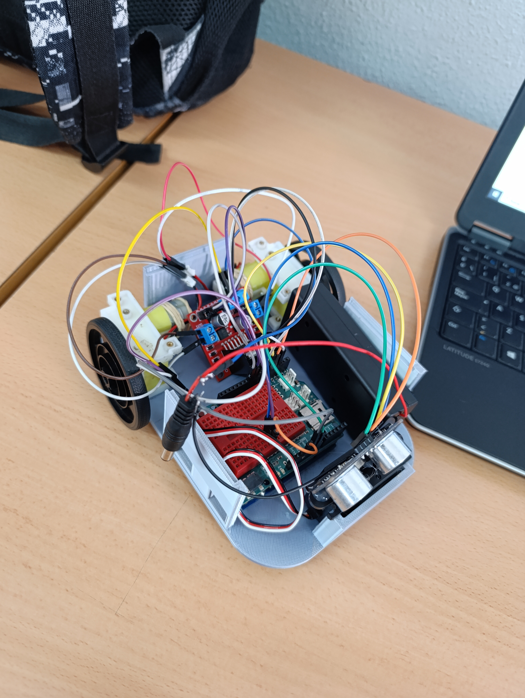

# -Diseño 3D del chasis del robot.

|       Diseño            |       Diseño  |
| -------------            |      -------------         |
|                         |                          |

# -Robot laberinto.

## Chasis del robot.

     

Este es el chasis del robot en donde van a ir:

__2 Motores de corriento continua con reductoras__ 

__1 shield L298n__

__1 seromotor__

__1 ultrasonido__ 

__1 portapilas con pilas de 18650 de 3,7 voltios cada una__

__1 placa de arduinos__

## Montaje de sensores.

En las 2 esquinas traseras van 2 los __motores__, entre los dos motores van el __escudo__, en la parte delantera donde se ve una especie de columna va el __servomotor__ para que encaje perfectamente sin que el __servomotor__ se mueva y encima del servomotor va el __ultrasonido__, en la columna de la derecha donde se ven dos huecos va la __placa de arduinos__ para poder meter la corriente y actualizar la placa y por ultimo a la izquierda de la __placa de arduino__ va el __porta pilas__.

     

## Montaje de sensores con cableado.

|       Diseño            |       Diseño  |
| -------------            |      -------------         |
|                         |                          |

Todo el cableado va conectado a la __placa de arduinos__.

### -Motores:

Cada motor tiene 2 cables que cada uno van conectados al __shield__ en sus 4 puertos de salida.

### -Shield:

En el puerto de __GND__ lo conectamos a la placa de arduino al puerto __GND__ tambien.

El puerto de __12v__ va conectado (soldado) al cable positivo de la bateria para poder alimentar a los motores.

Los 4 pines llammado __IN1, IN2, IN3 e IN4__ son los que se utilizan para poder controlar la dirección de los motores y estos van conectados a la placa de arduinos a los pines 7, 8, 9 y 10.

### -Servomotor:

En el __servomotor__ tenemos 3 cables:

El cable negro va conectado al puerto __GND__.

El cable rojo va conectado al puerto __5v__.

El cable blanco va conectado al pin __3__.

### -Ultrasonido:

En el __ultrasonido__ tenemos 4 cables:

El pin __GND__ va conectado al puerto __GND__ del arduino.

El pin __VCC__ va conectado al puerto __5v__ del arduino.

El pin __trigger__ va conectado al pin __5___ del arduino.

El pin __echo__ va conectado al pin __4___ del arduino.

