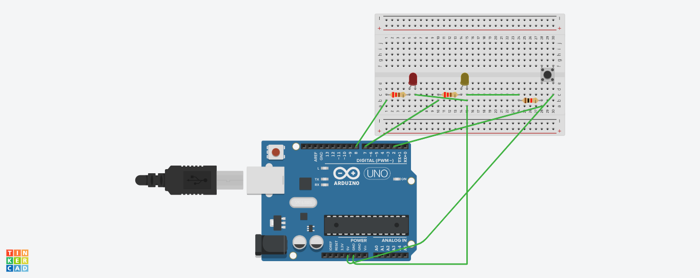

# 1erproyecto: Encendidos alternativos. 

## Explicación del circuito:

Lo que tiene que hacer el circuito es que cuando se encienda los diodos leds se esten encendiendo y apagando por separado lo mas rapido posible.

## Codigo:

Mi codigo comienza con el void sutup (sirve para ejecutar un bloque de código una sola vez al inicio del programa),
continua con el  pinMode(8, OUTPUT);

# 2erproyecto: Pulsador. 

## Explicación del circuito:
El objetivo del circuito es que cuando el programa se ponga en marcha un diodo led se encienda y cuando pulsemos el pulsador el que esta encendido se apague y el otro se encienda mientras que este pulsado.

## Codigo:
