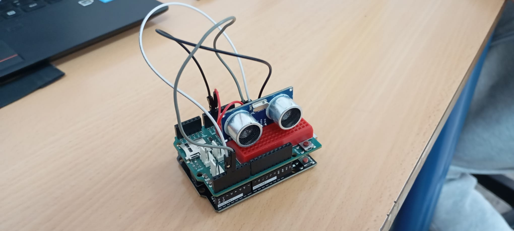
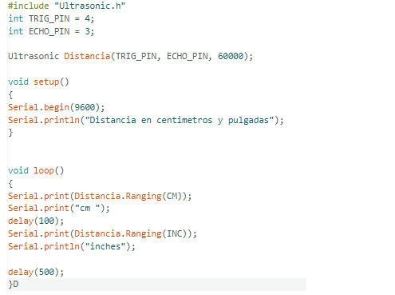
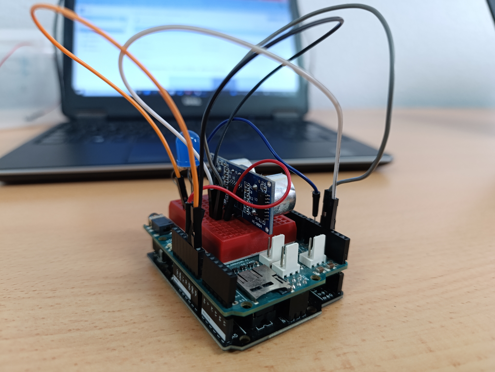
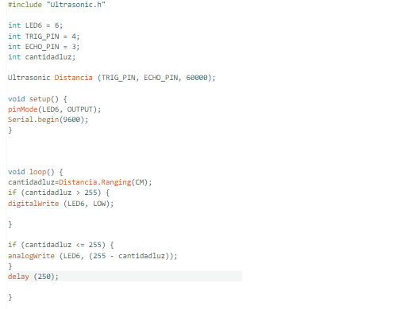

# -1erproyecto: Encendidos alternativos. 

## Explicación del circuito:

Lo que tiene que hacer el circuito es que cuando se encienda los diodos leds se esten encendiendo y apagando por separado lo mas rapido posible.

## Codigo:

Mi codigo comienza con el void sutup (sirve para ejecutar un bloque de código una sola vez al inicio del programa),
continua con el  pinMode(8, OUTPUT); y pinMode(7, OUTPUT); (lo que hace esto es que el pin que este seleccionado sea de salida).
El programa continua con un void loop() (se usa para crear un bucle), el digitalWrite(8, HIGH) se usa para establecer un pin digital en estado alto (HIGH) y bajo (LOW) , despues el otro pin digitalWrite(7, LOW) lo ponemos bajo, usamos un delay(120) para que cuando se use el primer programa haya un tiempo de espera de 120 milisegundo. Despues el lo mismo pero intercambiando el low por el high y fin del programa.

# -2erproyecto: Pulsador. 

## Explicación del circuito:
El objetivo del circuito es que cuando el programa se ponga en marcha un diodo led se encienda y cuando pulsemos el pulsador el que esta encendido se apague y el otro se encienda mientras que este pulsado.

## Codigo:

Al empezar el código creamos 4 variantes, que se crea con el comando __int__ (funciona creando un nombre para esa variable y poder utilizarlo duranto todo el codigo).

Hemos creado dos variables para los dos leds llamadas __LED7__ y __LED8__.

Otra para el pulsador llamada __pulsador__.

Y por ultimo la variante para el valor que nos salga llamada __valor2__.
 
Dentro del __void setup__ usamos 3 __pinmode__ uno del __pulsador__ que lo ponemos de __entrada__  y los otros dos son de los __led 7 y 8__ que lo ponemos como salida.

El __serial.begin(9600)__ es la velocidad de transmision en bits por segundo para que el arduino pueda enviar y recibir datos.

Sigue con el __void loop__ de primeras tenemos que el __valor2 = digitalwrite(pulsador)__ (esto significa que el valor2 va a ser igual al del pulsador. A continuación usamos el __if__ (compararor) y le preguntamos si el __valor2 = high__ (si el valor2 esta encendido) el __digitalWrite(LED7, LOW)__ y el __digitalWrite(LED8, HIGH)__ (lo que le preguntamos aqui es que si el valor2 esta encendido el led 7 esta apagado y el led 8  encendido), 
y abajo es lo mismo pero al reves.

# -3erproyecto: Potenciometro. 

## Explicación del circuito:

Lo que tiene que hacer el circuito es que cuando cambiemos  el valor del potenciometro el led se ilumine mas o menos.

# -4erproyecto: Mapeado de potenciometro. 

## Explicación del circuito:

Lo que tiene que hacer el circuito es que cuando cambiemos  el valor del potenciometro el led se ilumine mas o menos.

## Codigo:

Al empezar tenemos 4 variables una es el led __(LED1 = 6)__, el potenciometro __(potenciometro = A2)__ la luz del led __(cantidadluz)__  y el valor del potenciometro __(valorpotenciometro)__.

Añadimos el __void setup__ dentro ponemos __pinMode(LED1, OUTPUT)__ (ponemos el led como salida) y el __Serial.begin(9600)__.

Añadimos el __void loop__, y ponemos que  el __valorpotenciometro = analogRead(potenciometro)__ (esto significa que el valor que tenga el potenciometro va a ser igual a la lectura analogica del potenciometro).

__cantidadluz = map(valorpotenciometro, 0, 824, 0, 255);__ (La cantidad de luz que va tener el led va ser la que este dentro del __map__ que es el mapeado una regla de 3, dentro de esta explicamos que el valor de nuestro potenciometro es desde el 0 hasta el 824 (un potenciometro puede dar valores de 0 a 1023 pero el nuestro no llega a ese numero) y los otros numeros que van del 0 al 225 es el velaor de intensidad que puede tener nuestro diodo).

En el __analogWrite(LED1, cantidadluz)__  (aqui solo estamos indicando que el diodo led va tener la cantidad de luz que nos de de del mapeado de antes).

# -5erproyecto: Ultrasonido.

## Explicación del circuito:

El objetivo es que el sensor de ultrasonido detecte las distancias dependiendo si esta cerca o lejos y nos de el valor.

## Codigo:

El programa empieza con el __#include "Ultrasonic.h"__ (estoy es como una variable que usamos para hacer indicar que en este programa vamos a usar el ultrasonido), tambien si vamos a usar el utrasonido tenemos que tenerlo en la libreria de arduino. 
A continuacion tenemos dos variables __TRIG_PIN = 4__ y __ECHO_PIN = 3__ (el pin trigger es el que envia el inpulso ultrasonico y el echo es que lo recibe despues de robotar).
Y por ultimo tenemos la variable __Ultrasonic Distancia (TRIG_PIN, ECHO_PIN, 60000)__ (esto lo que indica es hasta la distancia maxima que vamos a la que mide el ultrasonida).

Añadimos el __void setup__ y dentro el __Serial.begin(9600)__

Y despues el __void loop__ donde dentro ponemos __Serial.print(Distancia. Ranging (CM))__ (esto solo indica que la distancia la vamos a medir en cm)  __Serial.print("cm")__ (esto es para decir que que nos lo ponga en cm).

y despues abajo del __delay__ ponemos lo mismo pero midiendolo en pulgadas.

# -6erproyecto: Control de luminosidad con un ultrasonido

## Explicación del circuito:

Lo que hace este programa es que cuando algo se acerque al ultrasonido este se ilumine y si se aleja vaya perdiendo la luminosidad poco a poco.

## Código:

-En el codigo usamos 5 variantes __LED6__, __TRIG_PIN__, __ECHO_PIN__, __cantidaddeluz__ y __Distancia__ Y tambien ponemos el __include "Ultrasonic.h__ para añadir el ultrasonido de la biblioteca.

-En el __void setup__ ponemos el __LED6__ como salida y la velocidad en bits que va a pasar.

-Dentro del __void loop__ lo primero que vamos a hacer es decir que la distancia que nos de el ultrasonido lo vamos a medir en centimetros __(cantidadluz-Distancia.Ranging(CM))__.
Despues usamos el __if__ que esto es para indicar una decisión, en este caso decimos que si la cantidad de luz es mayor a 255 el diodo led se apaga.

Y en la otra decision que tomanos con el __if__ es que si la cantidad de luz es menor o igual que 255 el led va a tener la cantidad de luz que salga de la resta de 255 y la cantidad de luz que nos de en el ultrasonido.

